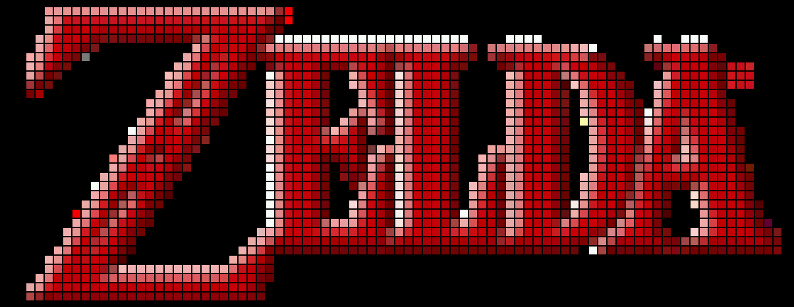

# description
dmd-simulator is a server that aims to simulate a real dmd into a browser.

dmd-play is a client that connect on the server to load images (png and animatd gif) or texts.

dmd-play and dmd-simulator communicates via a tcp connexion.

dmd-simulator and the browser communicates via websockets.

# build
``$ docker build -t dmd-simulator .``

# execute
``$ docker run -ti -p 53533:53533 -p 53534:53534 -p 8080:8080 dmd-simulator``

run in browser : http://localhost:8080/?size=12&top=200&mode=led

## url optionnal options
- mode includes: led | flat
- size : pixel size
- top  : border from the top

# play an image from the client
<code>$ python3 dmd-play.py -f file.png
$ python3 dmd-play.py -f file.gif
$ python3 dmd-play.py -t "Hello world"
$ python3 dmd-play.py --help
options:
  -h, --help            show this help message and exit
  -f FILE, --file FILE
  -t TEXT, --text TEXT
  --font FONT           path to the font file
  --moving-text         always makes the text to move, even if text fits
  --fixed-text          never makes the text to move, prefer to adjust size
  -r RED, --red RED     red text color
  -g GREEN, --green GREEN
                        green text color
  -b BLUE, --blue BLUE  blue text color
  -s SPEED, --speed SPEED
                        sleep time during each text position (in milliseconds)
  --once                don't loop forever
  -p PORT, --port PORT  network connexion port
</code>

# examples

